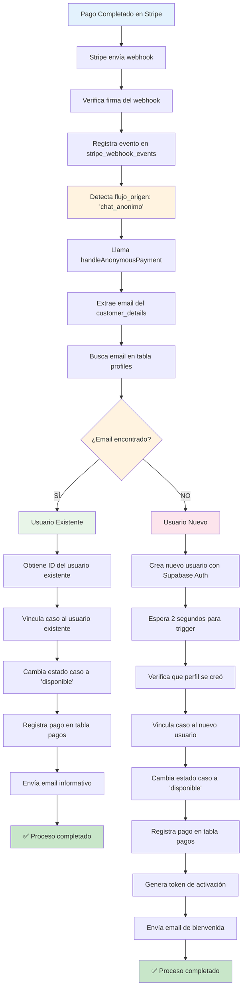
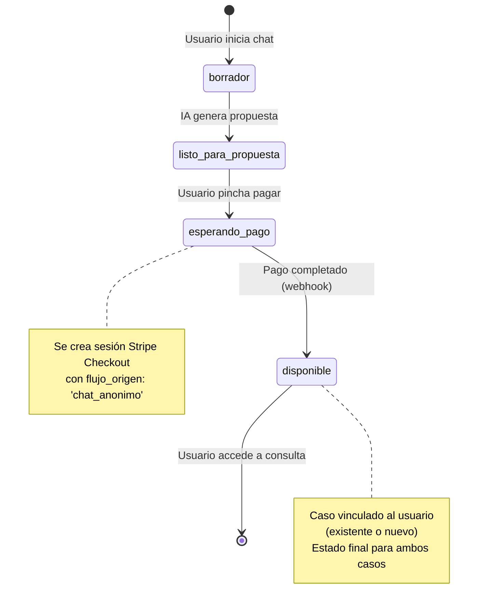
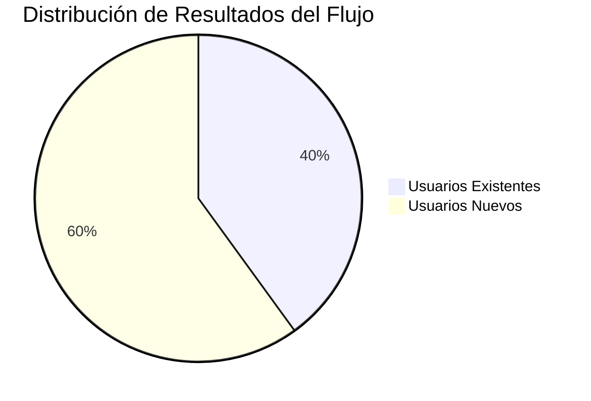
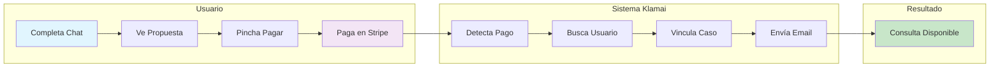

# Diagramas Mermaid - Flujo de Pago Anónimo

## 🎯 Flujo Principal del Proceso

```mermaid
flowchart TD
    A[Usuario Anónimo] --> B[Completa Chat con IA]
    B --> C[Recibe Propuesta Personalizada]
    C --> D[Pincha "PAGAR CONSULTA"]
    D --> E[Va a Stripe Checkout]
    E --> F[Escribe su Email]
    F --> G[Completa el Pago]
    G --> H[Stripe Confirma Pago]
    H --> I[Nuestro Sistema Procesa Automáticamente]
    I --> J{¿El email ya existe en nuestra base de datos?}
    
    J -->|SÍ| K[Vincula a Cuenta Existente]
    J -->|NO| L[Crea Nueva Cuenta Automáticamente]
    
    K --> M[Envía Email: "Nueva consulta añadida"]
    L --> N[Envía Email: "Bienvenido - Activa tu cuenta"]
    
    M --> O[Usuario accede desde su dashboard]
    N --> P[Usuario activa cuenta y accede]
    
    O --> Q[✅ Consulta disponible en su cuenta]
    P --> Q
    
    style A fill:#e1f5fe
    style Q fill:#c8e6c9
    style J fill:#fff3e0
    style K fill:#f3e5f5
    style L fill:#f3e5f5
```

## 🔀 Flujo Detallado de Decisión



## 📊 Arquitectura del Sistema

```mermaid
graph TB
    subgraph "Frontend"
        A[ProposalDisplay.tsx]
        B[Usuario pincha "Pagar"]
    end
    
    subgraph "Edge Functions"
        C[crear-sesion-checkout-anonima]
        D[stripe-webhook]
        E[generate-client-activation-token]
        F[send-email]
    end
    
    subgraph "Base de Datos"
        G[Tabla: casos]
        H[Tabla: profiles]
        I[Tabla: pagos]
        J[Tabla: client_activation_tokens]
        K[Tabla: stripe_webhook_events]
    end
    
    subgraph "Servicios Externos"
        L[Stripe Checkout]
        M[Stripe Webhooks]
        N[Supabase Auth Admin]
        O[Email Service]
    end
    
    A --> B
    B --> C
    C --> L
    L --> M
    M --> D
    D --> K
    D --> G
    D --> H
    D --> I
    D --> J
    D --> N
    D --> E
    D --> F
    F --> O
    
    style A fill:#e1f5fe
    style D fill:#fff3e0
    style L fill:#f3e5f5
    style M fill:#f3e5f5
    style K fill:#e8f5e8
```

## 🎯 Flujo de Estados del Caso



## 📈 Métricas y Resultados



## 🔧 Componentes Técnicos (Simplificado)



---

*Estos diagramas muestran el flujo completo del sistema de pago anónimo, desde la interacción del usuario hasta el procesamiento automático en el backend.*
