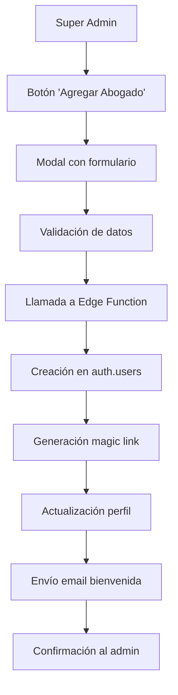
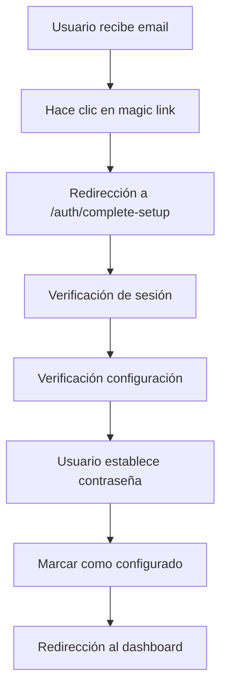

# 🚀 Sistema de Gestión de Abogados - KlamAI

## 📋 Resumen Ejecutivo

Sistema completo para la gestión integral de abogados en la plataforma KlamAI, incluyendo creación manual, activación automática, y gestión de perfiles profesionales.

## 🎯 Funcionalidades Implementadas

### ✅ Creación Manual de Abogados
- **Interfaz administrativa** para super administradores
- **Formulario completo** con validación de datos
- **Creación automática de usuario** en Supabase Auth
- **Generación de magic links** seguros
- **Envío de emails profesionales** de bienvenida

### ✅ Sistema de Activación Seguro
- **Magic links únicos** con expiración automática
- **Página de configuración** dedicada (`/auth/complete-setup`)
- **Validación de contraseñas** robusta
- **Redirección automática** basada en roles
- **Prevención de accesos no autorizados**

### ✅ Gestión de Perfiles Profesionales
- **Información completa**: nombre, email, teléfono, especialidades
- **Datos profesionales**: colegio, número de colegiado, experiencia
- **Ubicación**: ciudad de residencia
- **Estado de configuración**: seguimiento de activación

### ✅ Sistema de Emails Automatizado
- **Templates HTML profesionales** con diseño responsive
- **Magic links integrados** en botones de acción
- **Información de seguridad** clara
- **Instrucciones paso a paso** para usuarios

## 🏗️ Arquitectura Técnica

### 📁 Componentes Principales

#### Frontend
- **`LawyersManagement.tsx`**: Componente principal de gestión
- **`CompleteSetup.tsx`**: Página de configuración de contraseña
- **`LawyerProfileModal.tsx`**: Modal de visualización/edición de perfiles

#### Backend (Edge Functions)
- **`create-lawyer-manually`**: Creación de abogados con magic links
- **`send-lawyer-welcome-email`**: Envío de emails de bienvenida

#### Base de Datos
- **Tabla `profiles`**: Perfiles de usuarios con campo `configuracion_completada`
- **Tabla `auditoria_seguridad`**: Registro de acciones administrativas

### 🔄 Flujos de Trabajo

#### 1. Creación Manual por Admin


#### 2. Activación por Usuario


## 🔐 Seguridad Implementada

### Autenticación y Autorización
- **Verificación de permisos**: Solo super administradores pueden crear abogados
- **Validación de sesiones**: Control estricto de estados de autenticación
- **Magic links seguros**: Enlaces únicos con expiración automática
- **Prevención de duplicados**: Verificación de emails existentes

### Validación de Datos
- **Campos obligatorios**: nombre, apellido, email
- **Validación de formato**: email, teléfono, números de colegiado
- **Longitud de contraseñas**: mínimo 8 caracteres con requisitos específicos
- **Especialidades**: validación de arrays de IDs válidos

### Auditoría y Monitoreo
- **Registro de acciones**: Todas las creaciones quedan auditadas
- **Logging detallado**: Seguimiento de errores y operaciones
- **Manejo de errores**: Rollback automático en caso de fallos

## 📧 Sistema de Emails

### Template de Bienvenida
```html
- Diseño profesional con gradientes
- Información clara del usuario
- Botón prominente "Activar mi cuenta"
- Instrucciones paso a paso
- Información de seguridad
- Créditos iniciales (100)
- Contacto del equipo
```

### Configuración Técnica
- **Servicio**: Resend API
- **Remitente**: KlamAI <noreply@klamai.com>
- **Asunto**: "¡Bienvenido a KlamAI! Activa tu cuenta de abogado"
- **Expiración**: 7 días para magic links

## 🎨 Interfaz de Usuario

### Panel de Administración
- **Botón "Agregar Abogado"**: Accesible desde gestión de abogados
- **Modal responsive**: Funciona en desktop y móvil
- **Estados de carga**: Indicadores visuales durante operaciones
- **Mensajes de éxito/error**: Feedback claro al usuario

### Página de Configuración
- **Verificación automática**: Estados de carga mientras se valida
- **Formulario de contraseña**: Con indicadores de fortaleza
- **Requisitos visuales**: Lista de criterios de seguridad
- **Redirección automática**: Basada en rol del usuario

## 📊 Estados y Transiciones

### Estados del Usuario
```typescript
interface UserStates {
  nuevo: 'configuracion_completada = false';
  activado: 'configuracion_completada = true';
  super_admin: 'role = abogado, tipo_abogado = super_admin';
  abogado_regular: 'role = abogado, tipo_abogado = regular';
}
```

### Transiciones de Estado
- **Creación**: `null` → `nuevo`
- **Activación**: `nuevo` → `activado`
- **Redirección**: `activado` → dashboard correspondiente

## 🔧 Configuración y Despliegue

### Variables de Entorno Requeridas
```env
SUPABASE_URL=your_supabase_url
SUPABASE_SERVICE_ROLE_KEY=your_service_role_key
RESEND_API_KEY=your_resend_api_key
FROM_EMAIL=KlamAI <noreply@klamai.com>
SITE_URL=https://klamai.com
```

### Funciones Edge Desplegadas
- ✅ `create-lawyer-manually` v9 (ACTIVE)
- ✅ `send-lawyer-welcome-email` v5 (ACTIVE)

### Base de Datos
```sql
-- Campo agregado a tabla profiles
ALTER TABLE profiles ADD COLUMN IF NOT EXISTS configuracion_completada BOOLEAN DEFAULT false;
```

## 📈 Métricas y Monitoreo

### KPIs de Éxito
- **Tasa de activación**: Porcentaje de abogados que completan configuración
- **Tiempo de activación**: Promedio desde envío de email hasta activación
- **Tasa de error**: Porcentaje de creaciones fallidas
- **Satisfacción**: Feedback de administradores y abogados

### Logs y Alertas
- **Creación exitosa**: Logging de nuevos abogados
- **Errores de creación**: Alertas para debugging
- **Activaciones fallidas**: Seguimiento de problemas
- **Uso del sistema**: Métricas de adopción

## 🚀 Próximos Pasos y Mejoras

### Funcionalidades Pendientes
- [ ] Notificaciones push para activación
- [ ] Dashboard personalizado para nuevos abogados
- [ ] Sistema de onboarding guiado
- [ ] Integración con calendario para citas iniciales

### Mejoras Técnicas
- [ ] Rate limiting para creación de abogados
- [ ] Cache de especialidades para mejor performance
- [ ] Validación avanzada de emails
- [ ] Backup automático de configuraciones

### Mejoras de UX
- [ ] Tutorial interactivo para nuevos abogados
- [ ] Sistema de mentores para abogados junior
- [ ] Comunidad interna para networking
- [ ] Recursos de formación continua

## 📞 Soporte y Mantenimiento

### Contactos de Soporte
- **Administradores**: Super admins del sistema
- **Desarrolladores**: Equipo de desarrollo KlamAI
- **Soporte técnico**: support@klamai.com

### Procedimientos de Mantenimiento
1. **Monitoreo diario**: Revisar logs de creación/activación
2. **Backup semanal**: Copias de seguridad de configuraciones
3. **Actualización mensual**: Revisar métricas y KPIs
4. **Auditoría trimestral**: Verificación de seguridad

## 📝 Historial de Cambios

### v1.0.0 - Sistema Completo
- ✅ Creación manual de abogados
- ✅ Sistema de magic links
- ✅ Emails de bienvenida
- ✅ Página de configuración
- ✅ Gestión de perfiles
- ✅ Seguridad y auditoría
- ✅ Documentación completa

---

**Desarrollado por**: Equipo KlamAI
**Fecha**: Septiembre 2025
**Versión**: 1.0.0
**Estado**: ✅ Producción